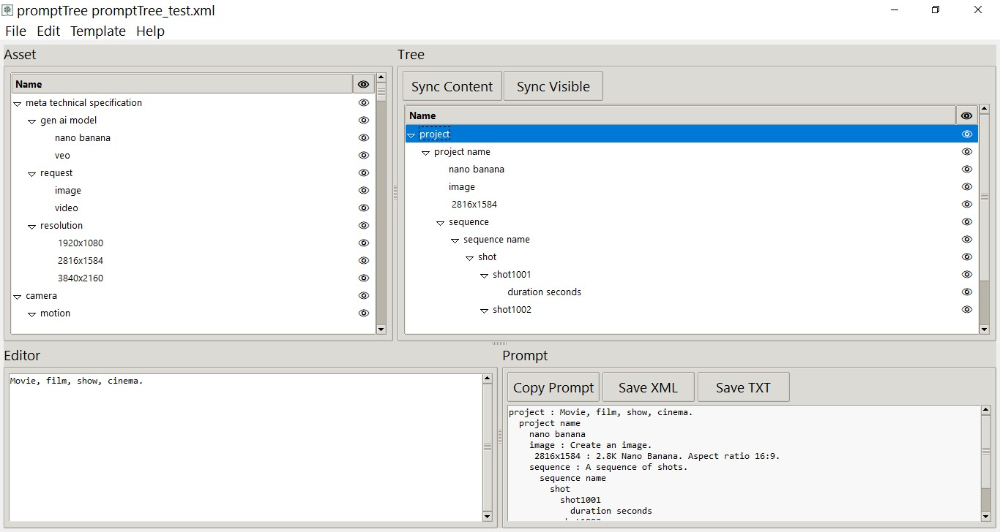

**Prompt Tree Version 1.0 **

**Technical Documentation**

## **Overview**

**Prompt Tree** is a specialized prompt-engineering application designed for Gen AI image and video production. It is built specifically for filmmakers to manage complex, multi-shot workflows by replacing monolithic text blocks with a structured, object-oriented framework.

By using a hierarchical "tree" approach, filmmakers can ensure prompt consistency across an entire production, making every element—from characters to cameras—a recyclable and easily editable asset.

## **The Four-Panel Interface**

**1. Asset Panel (Top-Left)** Your library of assets. This is where you create the core definitions for your project, such as characters and settings. Think ingredients.

**2. Tree Panel (Top-Right)** Your production staging area. You drag assets from your library into this panel to build out sequences, scenes, and individual shots. Think recipe.

**3. Editor Panel (Bottom-Left)** A simple text editor used to refine the specific prompt content.

**4. Prompt Result (Bottom-Right)** The live output window. It displays the compiled prompt (Export to Text or XML format) for whichever branch or node you have currently selected in the Tree.

## **Core Features & Workflow**

### **1. Object-Oriented Asset Management**

In standard prompting, changing a character's detail requires manual editing every shot prompt. In **Prompt Tree**, assets are "instanced":

- **Hierarchy:** Create parent nodes for categories (e.g., "Character") and child nodes for individuals (e.g., "Jane").

- **Recyclability:** Once Jane is defined in the Asset panel, you can drag her into 100 different shots.

- **Global Updates:** If you need to modify Jane’s appearance, you edit the single asset in the library. This automatically updates every shot in the Tree where she is used, eliminating the need to edit separate monolithic shot files.

### **2. Visibility Toggles**

Each node in the Tree has a **Visibility** setting. This allows you to store multiple states for one character within a single asset without them clashing.

- *Example:* In a "Home" shot, you can toggle Jane’s wardrobe asset "Pyjamas" to **Visible** and "Work Uniform" to **Invisible**. The final prompt will only generate the visible wardrobe choice.

### **3. XML Representation & "Prompt Bleed"**

While the software supports standard text, it defaults to **XML representation**, which is highly preferred by modern AI models.

- **The Benefit:** XML encapsulates descriptions within element tags. This prevents "Prompt Adjective Bleed," a common issue where a description of a background object accidentally leaks into the description of the character.

- **AI Digestibility:** Structured XML is much clearer for AI models to parse, leading to higher prompt adherence and more concise results.

### **4. Directorial Library**

The default template includes a comprehensive **Movie Directorial Prompt Library**. This allows filmmakers to explicitly direct:

- **Camera:** Composition, Motion, Lens.

- **Subject:** Character, Setting/Environment.

- **Specifications:** Resolution, Aspect Ratio.

### **5. Hierarchical Weighting**

In image and video models, elements at the beginning of a prompt often receive higher importance weight than those at the end. **Prompt Tree** allows users to manage this dominance by moving nodes up or down within the **Tree Panel**.

## **Controls & Maintenance**

- **Sync Buttons:** Located above the Tree Panel. Use these if the Assets or the Visibility in your Tree get out of sync after a major edit.

- **Insert Key:** Adds a new node to your structure.

- **Delete Key:** Removes the selected node.

- **Right-Click:** Opens a context menu with advanced node properties and options.

- **XML Button:** Saves the current prompt configuration to an .xml file, which can be uploaded directly to AI generation platforms.
