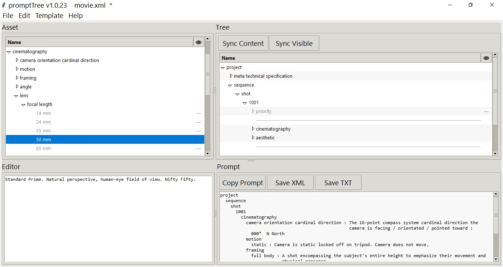

# **Prompt Tree v1.0.24**

## **Overview**

**Prompt Tree** is a specialized prompt-engineering Windows-based application designed for Generative AI image and video production. It is built specifically for filmmakers to manage complex, multi-shot workflows by replacing monolithic text blocks with a structured, object-oriented asset framework. By using a hierarchical tree approach, every element—from characters to cameras—becomes a recyclable and easily editable asset.

## **The Four-Panel Interface**

The application uses a **4-Panel layout** to manage the workflow:

- **Asset Panel (Top-Left):** Your library of assets and core definitions (characters, cinematography, settings, etc.).

- **Tree Panel (Top-Right):** The project hierarchy where you build sequences and shots by dragging assets from the library.

- **Editor Panel (Bottom-Left):** A text editor for the prompt content of the currently selected node.

- **Prompt Panel (Bottom-Right):** A live concatenated preview of the final prompt, formatted with indentation and hierarchy.

## **Core Features**

### **1. Object-Oriented Asset Management**

- **Instancing:** Dragging an Asset Panel node into the Tree Panel creates a link to the source.

- **Global Updates:** Modifying a source asset automatically updates every linked instance in the Tree Panel.

- **Inheritance:** Shots inherit assets from their parent nodes.

### **2. Visibility**

- There are three node visibility states :

1. **None**  Inherits visibility of parent node. This is the default visibility state.

2. 👁  Visible. Included in prompt.

3. —  Invisible. Excluded from prompt.

- The Asset Panel nodes and the Tree Panel nodes can have separate Visibility states.

### **3. Synchronization Buttons**

- **Sync Content:** Forces all linked node names and content in the Tree Panel to match the Asset Panel.

- **Sync Visible:** Forces all nodes in the Tree Panel to match the visibility of the Asset Panel.

## **Keyboard Shortcuts**

### **File Menu**

- **Ctrl+N**: New

- **Ctrl+O**: Open...

- **Ctrl+I**: Import...

- **Ctrl+S**: Save

- **Ctrl+Shift+S**: Save As...

- **Ctrl+Alt+S**: Save Version Up

- **Ctrl+Q**: Exit

### **Edit Menu**

- **Ctrl+Z**: Undo

- **Ctrl+Y / Ctrl+Shift+Z**: Redo

- **Ctrl+X**: Cut Node

- **Ctrl+C**: Copy Node

- **Ctrl+V**: Paste Node

- **Enter**: Add Sibling Node

- **Insert / Ctrl+Enter**: Add Child Node

- **- (Minus)**: Add Separator

### **Node Context Menu & Operations**

- **F2**: Rename Node

- **Ctrl+D**: Duplicate Node

- **Delete / Backspace**: Delete Node

- **V**: Toggle Visibility

- **Alt+V**: Reset Visibility

- **Ctrl+Shift+X**: Expand / Collapse All

- **Shift+X / Alt+Click**: Expand / Collapse Branch

- **Right/Left**: Expand / Collapse Selected Node

- **Ctrl+J**: Jump to Source Asset

### **Mouse Operations & Navigation**

- **Up/Down**: Navigate tree up and down.

- **Alt+Click**: Expand / Collapse clicked node and all its children.

- **Right-Click**: Opens context menu with advanced node options.

### **Prompt Operations**

- **Ctrl+Shift+C**: Copy Prompt

### **Template Menu**

- **Load Template**: The application automatically scans a local `template/` folder for `.xml` files. Clicking a template from this menu will replace the current workspace with the template's structure without overwriting the original file.

## **Drag & Drop Logic**

- **Top Third of Node**: Drops the item **before** the target node.

- **Middle Third of Node**: Drops the item **into** the target node as a child.

- **Bottom Third of Node**: Drops the item **after** the target node.

- **Escape**: Cancel active drag and drop.

## **UI Buttons & Exports**

### **Tree Panel Buttons (Top-Right)**

- **Sync Content**: Forces all linked node names and content in the Tree Panel to match the Asset Panel.

- **Sync Visible**: Forces all nodes in the Tree Panel to match the visibility of the Asset Panel.

### **Prompt Panel Buttons (Bottom-Right)**

- **Copy Prompt**: Copies the current indented preview to the clipboard.

- **Save XML**: Saves the current prompt configuration to an hierarchically tagged `.xml` file for AI digestibility.

- **Save TXT**: Exports the prompt as a standard plain text file.

