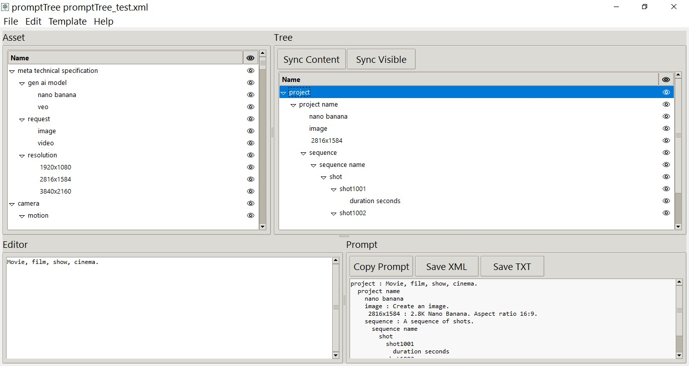

# **Prompt Tree v1.0.22**

## **Overview**

**Prompt Tree** is a specialized prompt-engineering application designed for Generative AI image and video production. It is built specifically for filmmakers to manage complex, multi-shot workflows by replacing monolithic text blocks with a structured, object-oriented asset framework. By using a hierarchical "tree" approach, every element—from characters to cameras—becomes a recyclable and easily editable asset.

## **The Four-Panel Interface**

The application uses a **4-Panel layout** to manage the workflow:

- **Asset Panel (Top-Left):** Your library of assets and core definitions (characters, settings, etc.).

- **Tree Panel (Top-Right):** The project hierarchy where you build sequences and shots by dragging assets from the library.

- **Editor Panel (Bottom-Left):** A text editor for the "Value" or prompt content of the currently selected node.

- **Prompt Panel (Bottom-Right):** A live, concatenated preview of the final prompt, formatted with indentation and hierarchy.

## **Core Features**

### **1. Object-Oriented Asset Management**

- **Instancing:** Dragging an asset into the Tree creates a link to the source.

- **Global Updates:** Modifying a source asset in the library automatically updates every linked instance in the Project Tree.

- **Inheritance:** Shots inherit descriptions from their parent nodes, allowing for consistent environmental or stylistic prompts.

### **2. Visibility & Logic**

- **Visibility Toggle:** Nodes can be toggled as visible (👁) or hidden (—).

- **Prompt Exclusion:** Hidden nodes are excluded from the final concatenated prompt.

- **Effective Visibility:** A node is automatically excluded if any of its ancestors are hidden (indicated by a ◌ icon).

### **3. Synchronization Tools**

- **Sync Content:** Forces all linked nodes in the Tree to match the current structure and naming of the Asset library.

- **Sync Visible:** Mirrors the visibility states from the Asset library to the linked nodes in the Tree.

## **Keyboard Shortcuts**

### **File Operations**

- **Ctrl+N**: New Project.

- **Ctrl+O**: Open Project.

- **Ctrl+I**: Import/Merge Project.

- **Ctrl+S**: Quick Save.

- **Ctrl+Shift+S**: Save Project As....

- **Ctrl+Alt+S**: Save Version Up (Auto-increments `v0001`).

### **Node Operations**

- **Enter**: Add Sibling Node.

- **Insert / Ctrl+Enter**: Add Child Node.

- **F2**: Rename Node.

- **Ctrl+D**: Duplicate Node and all children.

- **- (Minus)**: Add visual separator line.

- **V**: Toggle Visibility.

- **Delete / Backspace**: Delete Node and children.

- **Shift+X**: Expand/collapse selected branch.

- **Ctrl+Shift+X**: Expand/collapse ALL nodes in tree.

### **Navigation & View**

- **Alt+Click**: Expand/Collapse node and all descendants.

- **Shift+X**: Toggle expand/collapse for the selected branch only.

- **Ctrl+Z / Ctrl+Y**: Undo / Redo.

### **Prompt Operations**

- **Ctrl+G**: Generate Prompt (Copy to clipboard).

- **Ctrl+C**: Copy preview text (when Tree is active).

## **Drag & Drop Logic**

The application uses placement indicators:

- **Top Third of Node**: Drops the item **before** the target node.

- **Middle Third of Node**: Drops the item **into** the target node as a child.

- **Bottom Third of Node**: Drops the item **after** the target node.

## **Exporting**

- **Copy Prompt:** Copies the current indented preview to the clipboard.

- **Save XML:** Exports the prompt as a hierarchically tagged XML file for AI digestibility.

- **Save TXT:** Exports the prompt as a standard plain text file.
